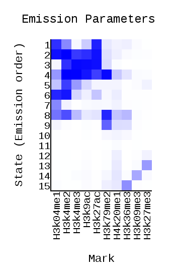
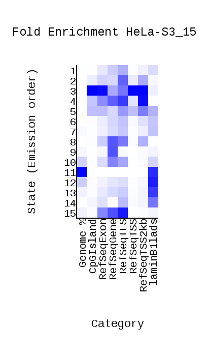
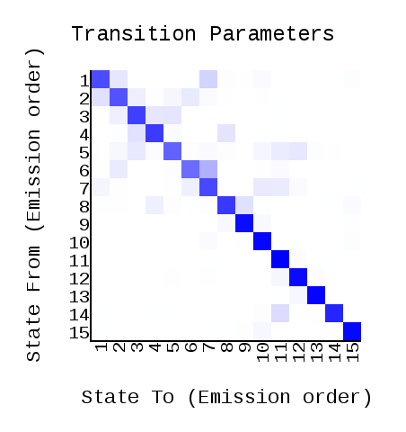
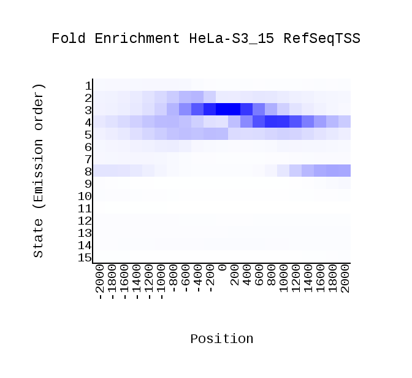
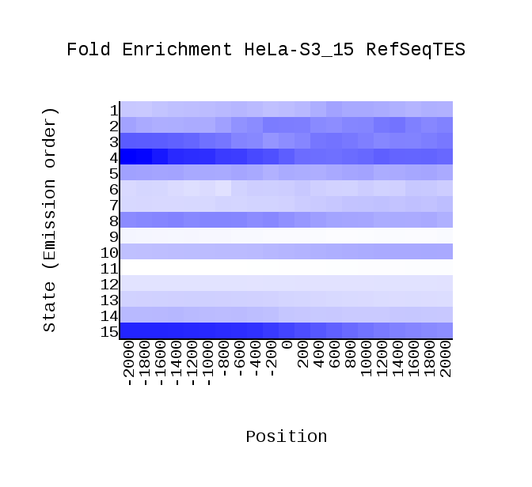
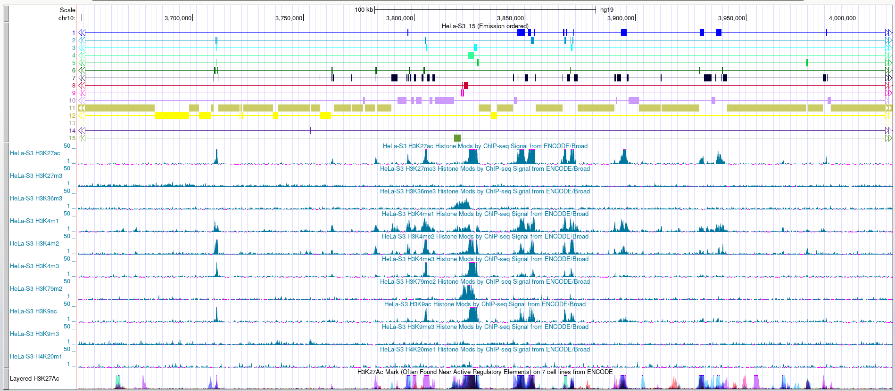

# Домашнее задание #3

## [Ссылка на Colab](https://colab.research.google.com/drive/1SmG81KdUVTK7tth0NukHe6x8LvcVJL0L?usp=sharing)

## Для исследования была выбрана клеточная линия `HeLa-S3`

## Обязательная часть

### Метки

| Name     | File                                             |
|----------|--------------------------------------------------|
| H3K27ac  | wgEncodeBroadHistoneHelas3H3k27acStdAlnRep1.bam  |
| H3K27me3 | wgEncodeBroadHistoneHelas3H3k27me3StdAlnRep1.bam |
| H3K36me3 | wgEncodeBroadHistoneHelas3H3k36me3StdAlnRep1.bam |
| H3K4me1  | wgEncodeBroadHistoneHelas3H3k04me1StdAlnRep1.bam |
| H3K4me2  | wgEncodeBroadHistoneHelas3H3k4me2StdAlnRep1.bam  |
| H3K4me3  | wgEncodeBroadHistoneHelas3H3k4me3StdAlnRep1.bam  |
| H3K79me2 | wgEncodeBroadHistoneHelas3H3k79me2StdAlnRep1.bam |
| H3K9ac   | wgEncodeBroadHistoneHelas3H3k9acStdAlnRep1.bam   |
| H3K09me3 | wgEncodeBroadHistoneHelas3H3k09me3AlnRep1.bam    |
| H4K20me1 | wgEncodeBroadHistoneHelas3H4k20me1StdAlnRep1.bam |

### cellmarkfiletable.txt

| Клеточная линия | Гистоновая метка | Файл         | Контрольный файл |
|-----------------|------------------|--------------|------------------|
| HeLa-S3         | H3K27ac          | H3K27ac.bam  | Control.bam      |
| HeLa-S3         | H3K27me3         | H3K27me3.bam | Control.bam      |
| HeLa-S3         | H3K36me3         | H3K36me3.bam | Control.bam      |
| HeLa-S3         | H3K4me1          | H3K4me1.bam  | Control.bam      |
| HeLa-S3         | H3K4me2          | H3K4me2.bam  | Control.bam      |
| HeLa-S3         | H3K4me3          | H3K4me3.bam  | Control.bam      |
| HeLa-S3         | H3K79me2         | H3K79me2.bam | Control.bam      |
| HeLa-S3         | H3K9ac           | H3K9ac.bam   | Control.bam      |
| HeLa-S3         | H3K9me3          | H3K9me3.bam  | Control.bam      |
| HeLa-S3         | H4K20me1         | H4K20me1.bam | Control.bam      |

### ChromHMM

| Emission                     | Overlap                            | Transition                     | RefSeqTSS                                         | RefSeqTES                                         |
|------------------------------|------------------------------------|--------------------------------|---------------------------------------------------|---------------------------------------------------|
|  |  |  |  |  | 

| №  | Название                                  | Описание                                    |
|----|-------------------------------------------|---------------------------------------------|
| 1  | Active Promoter                           | выражен в H3K27ac, H3K4me1, H3K4me2         |
| 2  | Weak enhancer/Weak transcribed            | выражен в H3K27ac, H3K4me1, H3K4me2         |
| 3  | Strong enhancer/Transcriptional elogation | выражен в H3K27ac, H3K4me1, H3K4me2         |
| 4  | Active Promoter                           | выражен в H3K27ac                           |
| 5  | Active Promoter                           | выражен в H3K4me1, H3K4me2                  |
| 6  | Weak enhancer                             | выражен в H3K4me1, H3K4me2, H3K4me3, H3K9ac |
| 7  | Weak enhancer                             | выражен в H3K4me1, H3K4me2                  |
| 8  | Weak enhancer                             | выражен в H3K36me3, H3K4me1                 |
| 9  | Weak enhancer                             | выражен в H3K36me3, H3K4me1                 |
| 10 | Weak transcribed                          | выражен в H3K4me1, H3K4me2                  |
| 11 | Weak transcribed                          | выражен примерно везде                      |
| 12 | Weak transcribed                          | выражен в H3K27me3                          |
| 13 | Repressed                                 | не выражен нигде                            |
| 14 | Heterochromatin                           | выражен в H3K27me3, H3K4me1, H3K4me2        |
| 15 | Heterochromatin                           | выражен в H3K36me3, H3K4me1                 |

## Дополнительная часть

Сделана в колабе
